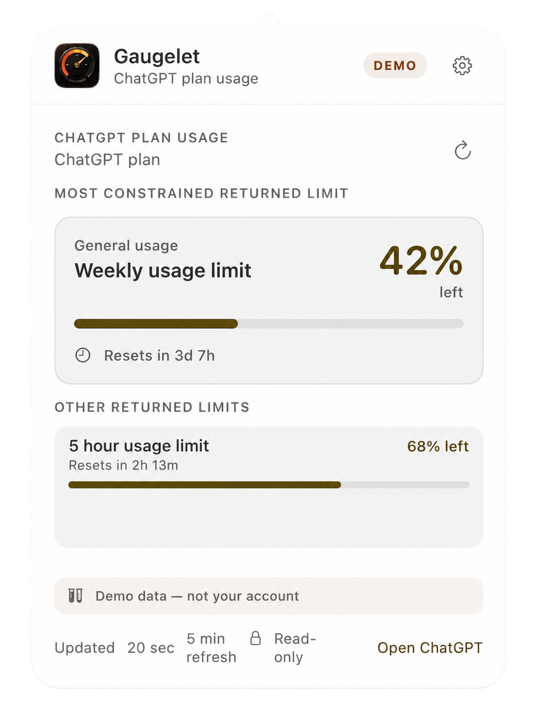

# Gaugelet

**Know what’s left. Keep the work moving.**


Gaugelet is a beautiful, native macOS menu-bar gauge for your **ChatGPT and Codex allowance**. See the windows that matter before you choose a bigger model, deeper reasoning, or a faster pace—and before the work suddenly stops.

[**Download for Mac →**](https://github.com/lammworks/Gaugelet/releases/download/v1.0.0/Gaugelet.dmg) · [Official site](https://Gaugelet.lammworks.com) · [See all releases](https://github.com/lammworks/Gaugelet/releases) · [Read the install guide](INSTALL.md)

<p>
  <a href="https://github.com/lammworks/Gaugelet/releases/download/v1.0.0/Gaugelet.dmg"><strong> Download Gaugelet 1.0</strong></a>
</p>

> Gaugelet 1.0 is a free community release for Apple-silicon Macs. It is ad-hoc signed, not notarized by Apple, and may require **System Settings → Privacy & Security → Open Anyway** on first launch.

## Why Gaugelet?

Your AI plan is expensive. Your attention is expensive too.

Gaugelet gives you a quiet little signal before you commit to the heavy option. Check the gauge, choose the right level of power, and keep going with a plan instead of discovering the limit halfway through the important part.

- **ChatGPT + Codex allowance at a glance** — see the usage windows returned by your local Codex session.
- **The important counters stay visible** — overall, weekly, and special-model windows appear when they are available, with additional returned windows preserved too.
- **Refreshes every five minutes** — current enough for decisions, honest enough not to pretend it is real-time.
- **Seven beautiful themes** — light, blue, green, amber, rose, purple, and Dracula, with a Core blue identity for macOS system surfaces.
- **Native for Apple silicon** — made for the Mac, lives in the menu bar, and stays out of your way.
- **Private by design** — no Gaugelet account, analytics, advertising, usage-history database, or LammWorks backend.



## The tiny decisions that save a workday

Should this task get the strongest model? Is there enough room for one more long run? Is it time to lower reasoning or pace and keep moving?

Gaugelet helps you make those micro-adjustments deliberately. It reads the rate-limit information returned by the local Codex App Server and presents it in a calm, glanceable interface.

The numbers are informative, not magical: Gaugelet refreshes automatically every five minutes, and the Codex response can drift from the ChatGPT interface. During heavy use, either display may move faster or slower. OpenAI’s enforced limits remain authoritative.

## Requirements

- Apple-silicon Mac.
- macOS 14 Sonoma or newer.
- The official [Codex CLI](https://developers.openai.com/codex/cli), installed and signed in with a ChatGPT account that returns allowance data.

Gaugelet does not use the OpenAI Platform Usage API. That API measures API-platform consumption, not the ChatGPT-plan allowance returned to Codex.

## Install in five minutes

1. Install the official Codex CLI, run `codex`, and complete sign-in.
2. Download [`Gaugelet.dmg`](https://github.com/lammworks/Gaugelet/releases/download/v1.0.0/Gaugelet.dmg) and [`Gaugelet.dmg.sha256`](https://github.com/lammworks/Gaugelet/releases/download/v1.0.0/Gaugelet.dmg.sha256). Verify the checksum before opening the app.
3. Open the DMG and drag Gaugelet to **Applications**. Eject the DMG afterward.
4. Open Gaugelet from Applications. If macOS blocks it, use **System Settings → Privacy & Security → Open Anyway**.
5. Click the Gaugelet icon in the menu bar, confirm the source is live, and optionally enable Launch at Login and notifications in Settings.

See [INSTALL.md](INSTALL.md) for the complete installation and troubleshooting path. Gaugelet does not require Full Disk Access, Accessibility, Screen Recording, or access to your Documents, Desktop, or Downloads.

## A small app from an independent developer

Gaugelet is built and maintained independently by LammWorks. It is free, open source, and intentionally focused: one small Mac app that helps you use the plan you already pay for with a little more intention.

If Gaugelet saves you from an unnecessary hard stop—or simply earns a permanent place in your menu bar—[buy me a coffee](https://www.paypal.com/donate/?hosted_button_id=Z4QV6SJVXSCH4). It helps fund the time spent maintaining releases, testing updates, and keeping the experience polished.

**[☕ Buy me a coffee →](https://www.paypal.com/donate/?hosted_button_id=Z4QV6SJVXSCH4)**

## How it works

```text
Gaugelet ── private stdio pipe ──> codex app-server ── existing Codex session ──> OpenAI
    │
    └── displays account/rateLimits/read results; stores no usage-history database
```

- Gaugelet starts the locally installed `codex app-server` and makes a read-only `account/rateLimits/read` request.
- Authentication stays with Codex. Gaugelet does not read browser cookies, Codex authentication files, access tokens, API keys, prompts, responses, or project files.
- Live readings stay in memory. Preferences use standard macOS storage.
- Demo, stale, unavailable, blocked, and signed-out states are visibly distinguished. Missing data is never replaced with a plausible-looking estimate.

See [PRIVACY.md](PRIVACY.md) for the complete data boundary.

## Launch at Login and notifications

Launch at Login uses macOS’s supported main-app login-item service. Install Gaugelet in **Applications** first. If macOS requires approval, Gaugelet offers **Open Login Items Settings**; return to Gaugelet afterward so it can refresh the status.

Usage notifications are optional. Gaugelet asks macOS for permission and alerts only for live data crossing your selected threshold or reaching a limit. Demo and stale readings do not trigger alerts. Manage permission in **System Settings → Notifications → Gaugelet**.

## Updates

Gaugelet uses [Sparkle](https://sparkle-project.org/) to check the project’s signed GitHub Releases feed. Automatic checking is offered by the app and, if accepted, runs about once every 24 hours. You can also choose **Check for Updates**. Every download and installation requires confirmation.

Sparkle authenticates updates after installation; it does not make the initial app Apple-notarized. See [SECURITY.md](SECURITY.md) for the trust model.

## Limitations worth knowing

- Codex App Server is an experimental upstream interface and may change without notice.
- Returned windows, labels, percentages, reset times, and model-specific limits depend on your account and the upstream response.
- Five-minute polling, upstream caching, request timing, and different accounting surfaces can produce material differences from ChatGPT’s interface.
- Gaugelet is an informational display, not a billing, entitlement, availability, or spending guarantee.

## Help, source, and project policy

- [Installation](INSTALL.md)
- [Support](SUPPORT.md)
- [Privacy](PRIVACY.md)
- [Security](SECURITY.md)
- [Changelog](CHANGELOG.md)
- [Contributing](CONTRIBUTING.md)
- [Third-party notices](THIRD_PARTY_NOTICES.md)

Gaugelet is independent software. It is not affiliated with, endorsed by, or sponsored by OpenAI. OpenAI, ChatGPT, Codex, and GPT are trademarks or names of their respective owners.

Built by LammWorks.

## License

Gaugelet source code is available under the [MIT License](LICENSE). The Gaugelet name, app icon, logo, and brand assets are covered separately by [BRAND.md](BRAND.md).
